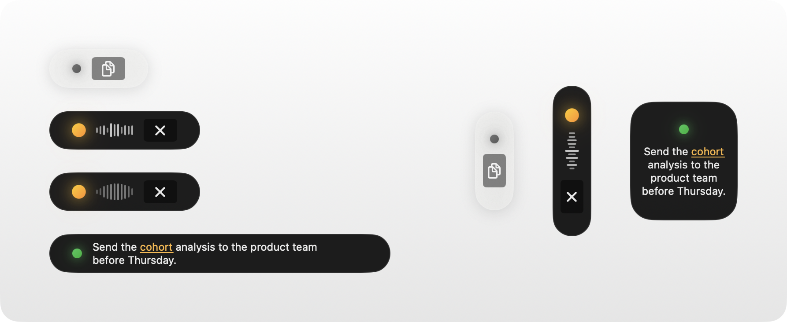
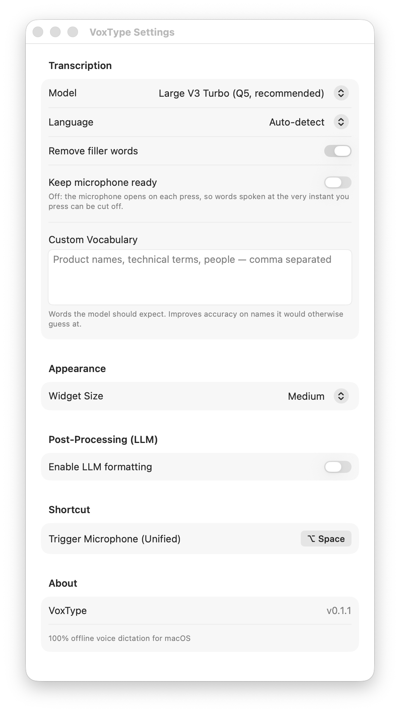

# VoxType

**Dictado por voz sin conexión para macOS.** Mantén presionado un atajo, habla, y tus palabras aparecen donde esté el cursor: en el correo, documentos, chats, editores de código o cualquier otra app. La transcripción ocurre por completo en tu Mac con [whisper.cpp](https://github.com/ggml-org/whisper.cpp). Sin cuenta, sin suscripción, y tu audio nunca sale de tu computador.

*[Read in English](README.md)*

<p align="center">
  <picture>
    <source media="(prefers-color-scheme: dark)" srcset="docs/user/img/widget-dark.png">
    
  </picture>
</p>

---

## Requisitos

- Un Mac con **Apple Silicon** (M1 o más reciente)
- **macOS 14 Sonoma** o más reciente
- **Xcode**, gratis en la [App Store](https://apps.apple.com/app/id497799835). VoxType se compila en tu Mac a partir de este código, y Xcode es la herramienta que lo hace.
- Unos **4 GB** de espacio libre

## Instalación

> **Descárgalo con `git clone`, no con el zip "Source code" de la página de Releases.** El zip no incluye el motor de voz (un submódulo de git), así que el instalador no puede terminar.

Abre la **Terminal** (presiona ⌘ Espacio, escribe *Terminal* y presiona Retorno) y pega:

```bash
git clone --recursive https://github.com/julianrolaya/voxtype.git
cd voxtype
./setup.sh
```

<details>
<summary><b>¿Nunca has usado la Terminal? Qué esperar</b></summary>

<br>

La Terminal es una ventana donde escribes o pegas instrucciones. Nada cambia en tu Mac hasta que presionas **Retorno**.

- **Pega las tres líneas de arriba** (⌘ V) y presiona Retorno. Se ejecutan una tras otra.
- **Puede aparecer una ventana pidiendo instalar las "herramientas de desarrollo de línea de comandos"** la primera vez que uses `git`. Es macOS quien lo pide. Haz clic en **Instalar**, espera a que termine y vuelve a pegar las líneas.
- **Puede pedirte tu contraseña.** Escribe la que usas para entrar a tu Mac. Mientras escribes no aparece nada, ni siquiera puntos. Es normal. Presiona Retorno al terminar.
- **Algunos pasos son lentos.** Descargar Xcode (si aún no lo tienes) y el modelo de voz depende de tu conexión. El instalador dice qué está haciendo en cada paso.
- **Si se detiene, vuelve a correrlo.** Abre la Terminal, escribe `cd voxtype`, presiona Retorno y luego `./setup.sh`. Continúa donde se quedó y salta lo que ya está hecho.

</details>

El instalador te guía en todo, paso a paso y numerado:

1. Verifica que tu Mac sea compatible
2. Revisa Xcode y, si hace falta, te ayuda a terminar de configurarlo
3. Instala la única herramienta de compilación que necesita (`cmake`, con [Homebrew](https://brew.sh)), preguntándote antes
4. Compila el motor de voz
5. Descarga un modelo de voz (tú eliges cuál) y verifica su checksum
6. *Opcional:* configura [Ollama](https://ollama.com) para limpiar el texto con IA local
7. Compila VoxType, lo instala en **Aplicaciones** y te abre la pantalla de permisos

Puedes volver a correr `./setup.sh` cuando quieras. Los pasos que ya están hechos se saltan.

### Permisos

VoxType pide dos permisos. El instalador te abre la pantalla correcta:

| Permiso | Para qué | Cómo |
|---|---|---|
| **Accesibilidad** | Para pegar el texto en la app donde estás escribiendo | Configuración del Sistema → Privacidad y seguridad → Accesibilidad → activa **VoxType** |
| **Micrófono** | Para escucharte | macOS lo pregunta la primera vez que dictas. Haz clic en **Permitir**. |

## Cómo se usa

Busca el ícono de VoxType en la barra de menús, arriba a la derecha de la pantalla.

- **Mantén ⌥ Opción + Espacio**, habla y suelta. El texto se escribe donde está el cursor.
- O **toca ⌥ Espacio** una vez para empezar y otra vez para terminar. Es útil para dictados largos.
- Mientras VoxType trabaja, un pequeño widget flotante muestra lo que está haciendo (ver más abajo).

En **ícono de la barra de menús → Settings** eliges el modelo de voz y el idioma (detección automática, inglés o español), quitas muletillas ("eh", "um") y agregas **vocabulario personalizado**: nombres y términos que el modelo debe esperar. **History** muestra tus dictados recientes.

<p align="center">
  <picture>
    <source media="(prefers-color-scheme: dark)" srcset="docs/user/img/settings-dark.png">
    
  </picture>
</p>

### El widget

Una pequeña píldora flota sobre tus demás ventanas para que siempre veas qué está haciendo VoxType.

| Ves | Significa |
|---|---|
| Un punto tenue | Listo |
| Un punto brillante con barras en movimiento | Escuchando |
| Lo mismo con las barras quietas | Transcribiendo |
| Tu texto | El resultado, visible unos segundos mientras se pega. Haz clic para cerrarlo. |

- **Cancela cuando quieras.** Haz clic en la **✕** del widget, o presiona ⌥ Espacio otra vez mientras transcribe. No se pega nada.
- **¿No estaba el cursor en un campo de texto?** Después de cada dictado aparece en el widget un pequeño botón de copiar durante un par de minutos, para que pongas el último resultado en el portapapeles y lo pegues tú.
- **Las palabras dudosas se subrayan en ámbar.** El modelo de voz informa qué tan seguro estuvo de cada palabra, y las que menos le convencieron se marcan para que sepas dónde mirar. Solo aplica cuando la limpieza con IA está apagada, porque esa limpieza reescribe las palabras que el modelo puntuó.
- **Ponlo donde quieras.** Arrástralo a cualquier lugar. Suéltalo cerca del borde izquierdo o derecho de la pantalla y se vuelve vertical para no estorbar. **Ícono de la barra de menús → Reset Widget Position** lo devuelve al centro inferior. Puedes cambiar su tamaño en Settings.

### Comandos de voz

Si dices uno de estos comandos solo, sin nada más, VoxType ejecuta la acción en lugar de escribir las palabras:

| Di | Hace |
|---|---|
| "deshacer" / "undo" | ⌘Z |
| "borrar" / "delete" | Borra la última palabra |
| "borrar todo" / "delete all" | Selecciona todo y lo borra |
| "seleccionar todo" / "select all" | ⌘A |
| "copiar" / "copy" · "pegar" / "paste" · "cortar" / "cut" | ⌘C · ⌘V · ⌘X |
| "nueva línea" / "new line" | Retorno |

## Opcional: limpieza del texto con IA

VoxType puede pasar lo que dictas por un modelo de lenguaje que corrige la puntuación y el formato (modo **Formatter**), o que trata tu dictado como una petición, por ejemplo "escribe una respuesta amable rechazando la reunión" (modo **Assistant**).

- **Ollama (local y privado).** Corre `./setup.sh --ollama` y luego actívalo en **Settings → Post-Processing (LLM) → Enable LLM formatting**.
- **OpenAI (en la nube).** Elige *OpenAI* como proveedor en esa misma sección y pega tu propia API key. La key se guarda en el Llavero de macOS. Con esta opción, el texto transcrito se envía a OpenAI.

> La limpieza con IA reescribe tu texto. Si mezclas idiomas en una misma frase, puede traducir una parte. Para una transcripción exacta, déjala apagada.

## Actualizar

```bash
cd voxtype
./setup.sh --update
```

Después de actualizar, macOS te pide volver a activar el permiso de Accesibilidad. El instalador te dice exactamente dónde hacer clic.

## Cambiar el modelo de voz

```bash
./setup.sh --model
```

| Modelo | Tamaño | Notas |
|---|---|---|
| Large V3 Turbo | ~575 MB | Recomendado. La mejor precisión para su tamaño. |
| Small | ~490 MB | Más liviano. Buena opción para Macs con 8 GB de memoria. |
| Medium | ~1.5 GB | Alternativa más antigua y más grande |

Luego cierra y vuelve a abrir VoxType para que cargue el modelo nuevo.

## Desinstalar

```bash
./uninstall.sh
```

Quita la app y sus permisos. Antes de borrar tus modelos, historial y ajustes, te pregunta.

## Privacidad

Por defecto todo ocurre en tu Mac. VoxType no envía nada por la red salvo que actives el proveedor OpenAI. En [docs/user/privacy.es.md](docs/user/privacy.es.md) está exactamente qué se guarda y dónde.

## Solución de problemas

Revisa [docs/user/troubleshooting.es.md](docs/user/troubleshooting.es.md). Lo más común:

- **El texto aparece en el widget pero no se pega.** Activa el permiso de Accesibilidad. Si ya se ve activado, quita VoxType de la lista con **−** y vuelve a agregarlo con **+**.
- **"VoxType needs a speech model".** Corre `./setup.sh --model`.
- **El instalador falló.** Vuelve a correrlo, continúa donde se quedó. El log completo está en `build/setup.log`.

## Compilar a mano (para desarrolladores)

```bash
git submodule update --init
cmake -S whisper.cpp -B whisper.cpp/build -DCMAKE_BUILD_TYPE=Release -DGGML_METAL=ON \
  -DCMAKE_OSX_DEPLOYMENT_TARGET=14.0 -DBUILD_SHARED_LIBS=OFF \
  -DWHISPER_BUILD_EXAMPLES=OFF -DWHISPER_BUILD_TESTS=OFF -DWHISPER_BUILD_SERVER=OFF
cmake --build whisper.cpp/build --config Release -j"$(sysctl -n hw.ncpu)"
open VoxType.xcodeproj
```

El proyecto de Xcode se genera desde `project.yml` con [XcodeGen](https://github.com/yonaskolb/XcodeGen). Las compilaciones se firman ad-hoc por defecto. Para firmar con tu propio certificado, crea `Config/Local.xcconfig` (ver `Config/Signing.xcconfig`). Eso además conserva el permiso de Accesibilidad entre compilaciones.

## Licencia

[MIT](LICENSE). VoxType se apoya en whisper.cpp y en los modelos Whisper de OpenAI. Ver [THIRD_PARTY_NOTICES.md](THIRD_PARTY_NOTICES.md).
